# 文档说明

本文档描述了如何在配置好Qt For OpenHarmony的 QtCreator集成开发环境中创建应用程序动态库的示例，QtCreator的配置操作见[QtCreatorSettings.md](.\QtCreatorSettings.md)文件。

# 创建Qt工程

## 1. 选择工程模板

运行配置完成后的QtCreator，点击Create Project新建工程，弹出新建工程对话框，选择Application(Qt) Qt Widget Application工程，列表中还列出了控制台工程及Qt Quick工程选择，我们以创建Widget工程为示例。如下图所示：

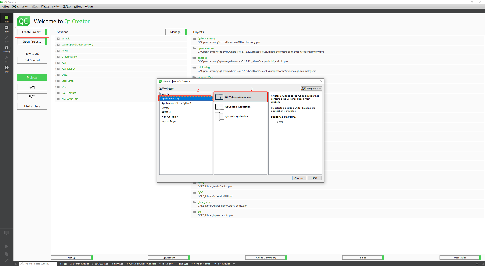

## 2. 工程信息填写

选择需要创建的工程模板，点击choose则弹出 如下导航窗口，该导航窗口引导用户填写创建工程所必须的一些信息，如工程名称及工程保存路径等，如下图所示。

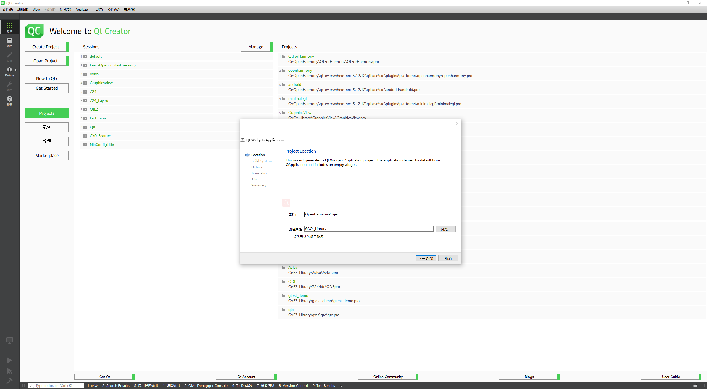

## 3. 选择构建系统

填写了工程名称及工程保存路径后点击下一步，选择工程的构建系统，如下图所示。这里我们选择qmake,其他构建系统的使用方式见各个构件系统的官方文档，这里不做详细论述。

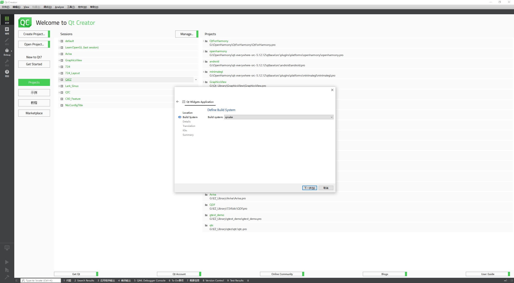

## 4. 填写详细信息

选择了构建系统后点击下一步，进行工程详细信息的填写，这一步导航窗口引导用户进行展示界面的生成和创建，用户需要填写界面类的名称及是否创建可拖拽的ui文件，如下图所示。

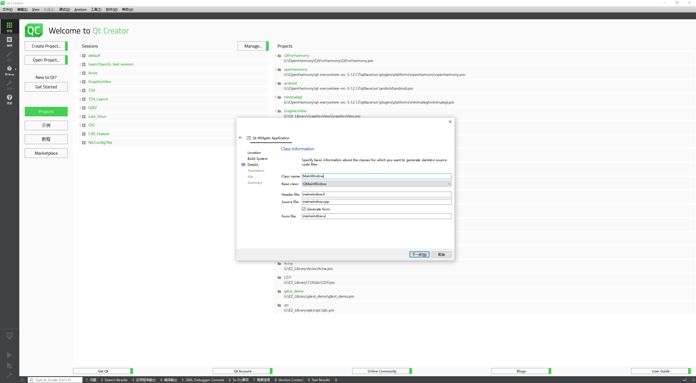

## 5. 国际化

完成了界面类信息的填写后，点击下一步，选择是否进行国际化操作，这一步会在工程中添加翻译模板，生成国际化操作所需要的文件，用户可以对这些文件进行国际化翻译及加载后，应用程序即可进行国际化展示，如下图所示，这里我们不讨论国际化相关内容，所以不做选择直接点击下一步略过。

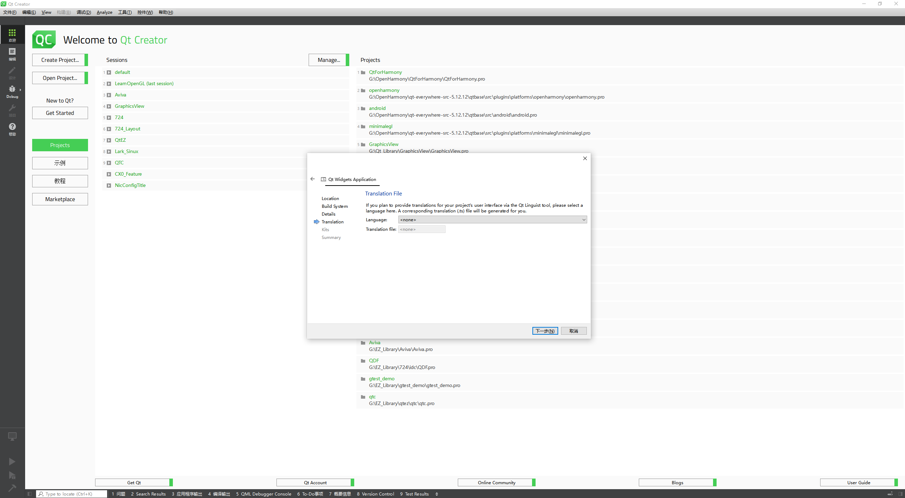

## 6. 选择构建套件

这一步选择工程所需要使用的编译构建套件，即在[QtCreatorSettings.md](.\QtCreatorSettings.md)文件中的Qt For OpenHarmony相关的配置，这里我们选择已经配置号的构建套件如下图所示。

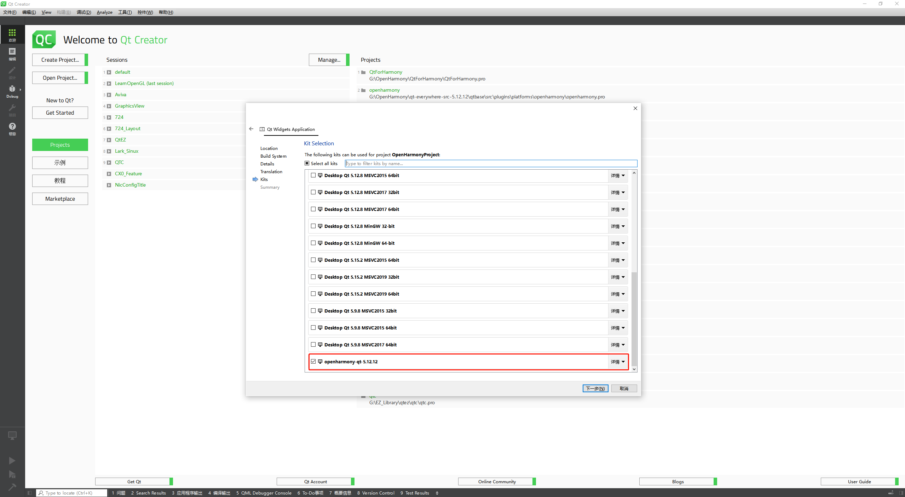

## 7. 完成编译

选择了构建套件后，点击下一步，这一步会展示本次工程会创建的的文件，以及是否将工程纳入到版本控制工具的管辖中，例如是否添加到git仓库，这里我们不需要加入到git仓库中，直接点击完成即可，如下图所示。

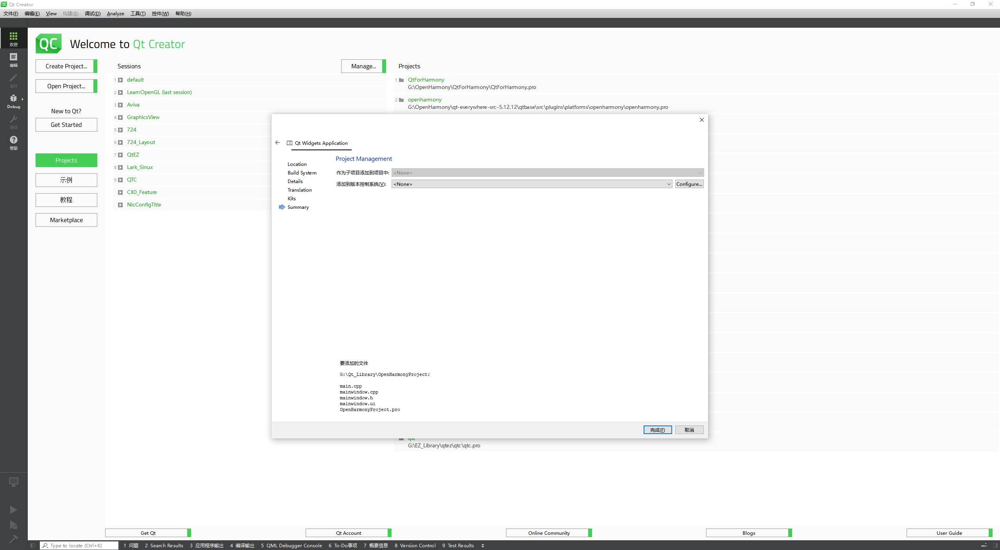

## 8. 工程结构

完成后创建的工程结构如下图所示。

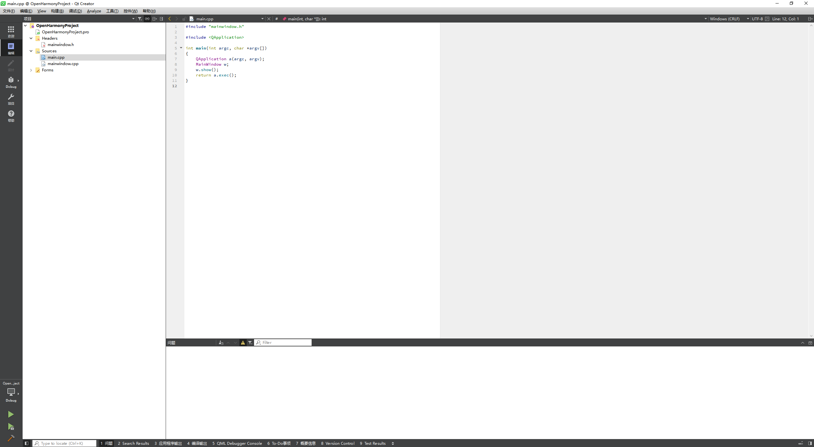

## 9. 编译构建

工程创建完成后点击构建，会在中间目录中生成工程同名的.so文件，该文件即是我们需要参与ets刚才创建并且运行在OpenHarmony系统下的库，如下图所示。

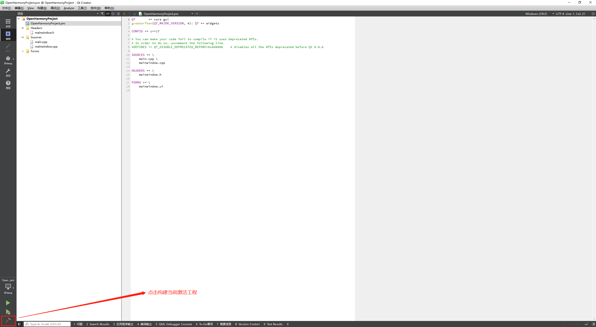

## 10. 查看生成的文件

工程生成文件默认生成在编译临时目录下，如下图所示，构建完成后，会再编译临时目录生成`libOpenHarmonyProject.so`文件。

生成文件如下：

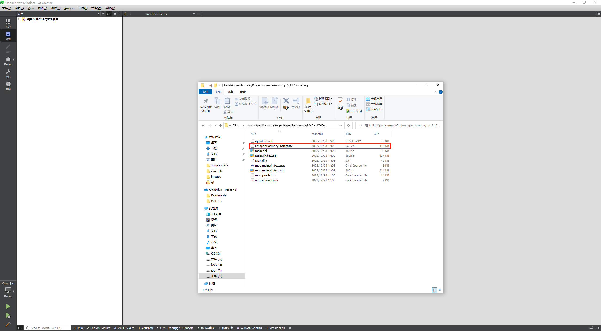

# 创建ETS工程

下载安装DevEco Studio[^下载]。DevEco Studio 配套支持HarmonyOS 的应用及服务开发，提供了代码智能编辑、低代码开发、双向预览、全新构建工具等功能，持续提升应用及服务开发效率。该工具的使用及配置参考官方文档，本文不做详细介绍。

## 1. 选择工程模板

运行安装的DevEco Studio工具，选择新建项目，在弹出的对话框中选择OpenHarmony下的Native C++项目，然后点击下一步如下图所示。

## 2. 工程信息填写

完成工程模板的选择后，进行必要的工程信息填写，如下图所示，填写工程名称及相关构建版本，然后点击完成生成新的工程项目。

## 3. 使用XComponent集成Qt工程

新建工程完成后内容，如下，修改Index.ets文件中的默认内容，我们使用XComponent组件来完成对Qt工程的集成，使得Qt编译的工程能运行在OPenHarmony系统中，如下图所示。这里`libraryname: 'plugins_platforms_qopenharmony'`为固定值，该库是支持Qt工程和ets工程交互的底层抽象库，该文件存放在QtSDK的plugins\platforms目录中。

## 4. 拷贝依赖项

现在我们将需要集成的Qt工程生成的库文件拷贝及其依赖库拷贝到ets工程中的libs\armeabi-v7a目录中，如果是64位程序则拷贝到相应的v8目录。若在Windows环境下可以使用mingw下的readelf.exe工具查看库的依赖，如下如图所示NEED表示的就是库需要依赖的其他库文件。

我们将非系统下的依赖库拷贝到上述所说目录中，如下图所示，然后构件项目，生成安装包。

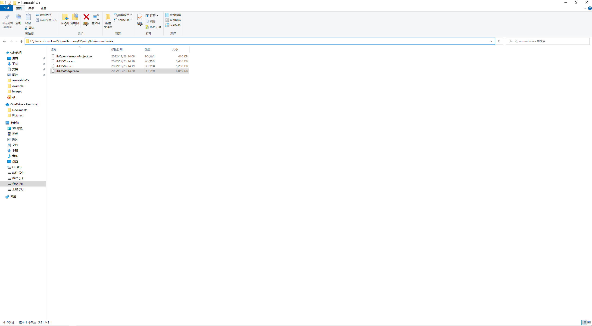

## 5. 构建带签名的包

选中上面文件菜单栏中的项目结构，在弹出的窗口中选择Signing Configs然后选择自动生成签名如下图所示，点击OK。现在构件的安装包则为带签名的包。

## 6. 部署到开发板

如果存在实机设备则可以点击导航菜单栏的绿色三角按钮选择部署的设备进行部署运行，如下图所示，程序就会运行在开发板上。

## 7. 添加资源文件

在项目开发中有时会使用到一些资源文件，例如图片资源和音频资源等，在Qt Quick工程中还需要加载QML相关的脚本文件，将需要用到的qml脚本文件等资源文件拷贝到ets工程中的resource目录中，如下图所示。

[^下载]: https://developer.harmonyos.com/cn/develop/deveco-studio