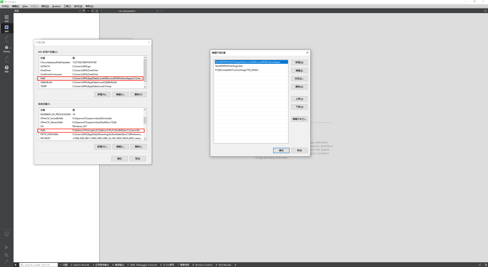
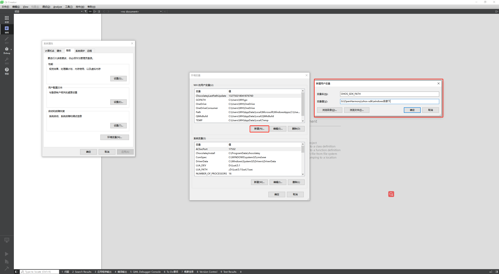
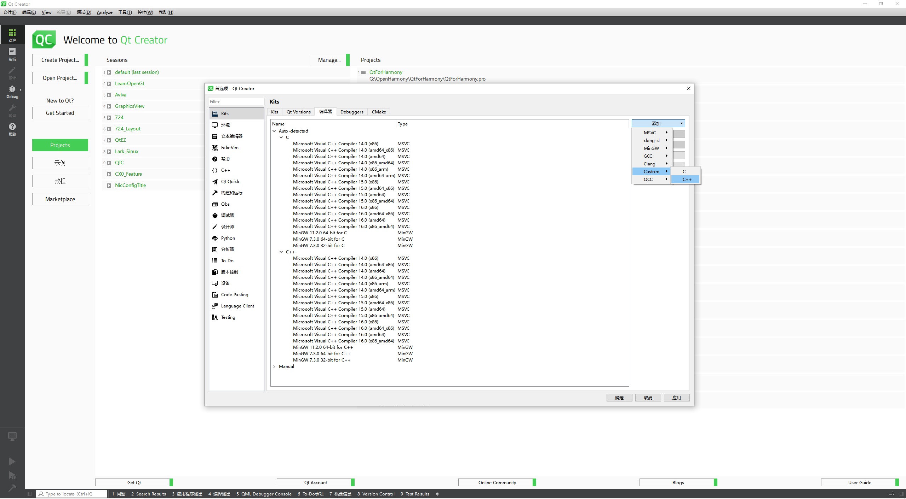
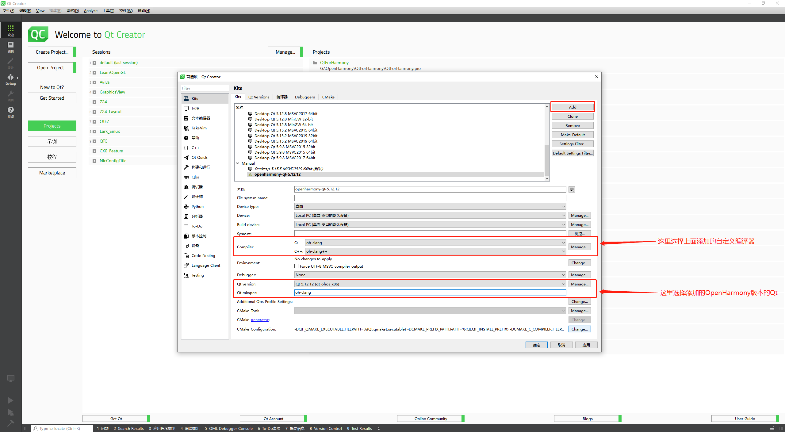

# 文档说明

本文档描述了在Windows环境下如何将编译完成后的QtSDK配置到QtCreator中使用，Linux下的操作类似，可做参考

# 环境配置

## 前提条件

1. 编译完成后的QtSDK  [^QtSDK]
2. QtCreator集成开发环境 [^下载地址]
3. OpenHarmony提供的编译套件 [^编译套件]，编译套件建议选择OpenHarmony_3.2.7.5版本。如下图所示：

4. Mingw编译套件，Mingw构件套件使用Qt在线安装工具时可以选择安装否则自行[下载](https://www.mingw-w64.org/downloads/)安装，安装版本同Qt版本相关，需要编译器支持对应Qt版本的编译。

## 使用配置

### 1. 配置环境变量

+ Mingw安装完成后将MIngw的路径配置到系统环境变量或用户环境变量下，例：本机安装Mingw版本为mingw730，则将对应路径添加到Path环境变量中，如下图所示：

+ 将下载的OpenHarmony开发套件解压，并解压native压缩文件，然后将解压后的文件添加为环境变量OHOS_SDK_PATH，例：假设本机OpenHarmony开发套件解压在G:\OpenHarmony\ohos-sdk\windows目录下，则添加环境变量如下图所示：

### 2. 配置QtCreator

1. 安装完成QtCreator后，运行QtCreator，运行界面如下所示。

2. 选中菜单栏中工具选项，在弹出的菜单中选中外部，在弹出的选项中选择Configure。

3. 在弹出框中选择左侧Kits选中进行开发环境配置，如下图所示。

4. 选择编译器分页，添加在前提条件章节提到的OpenHarmony编译开发套件，添加自定义的编译器，编译器路径选择下载的OpenHarmony编译套件的存放路径，如下图所示。

5. 自定义编译器配置内容如下图所示，C以及C++编译器都需要添加，C++选择clang++.exe

6. 然后选中Qt Version分页添加Qt qmake工具的，如下图所示，选中使用OpenHarmony下的QtSDK中的qmake工具。

7. 最后选中Kits分页进行编译套件的配置，我们添加自定义的OpenHarmony专属构件kits，配置如下图所示：

完成以上操作步骤后即可使用QtCreator集成开发环境编写及构建能在OpenHarmony系统下运行的Qt工程

[^QtSDK]: 编译配置见README.md文件中编译配置说明
[^下载地址]: https://download.qt.io/archive/qtcreator/
[^编译套件]: http://ci.openharmony.cn/dailys/dailybuilds