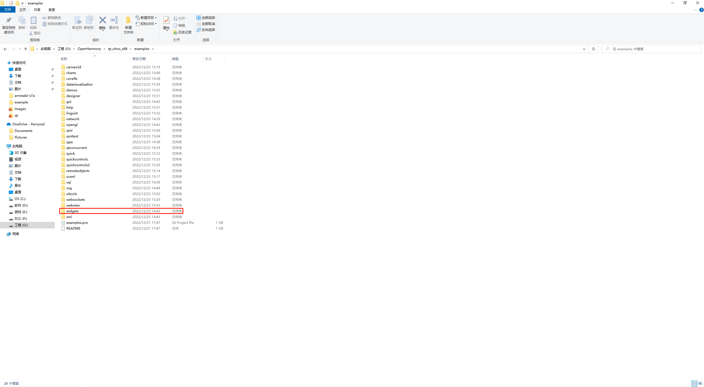
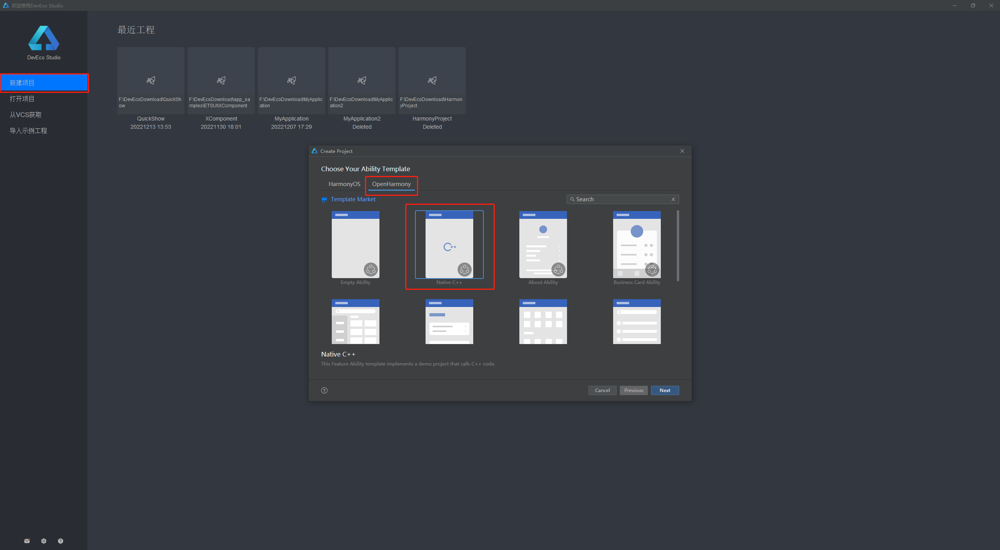
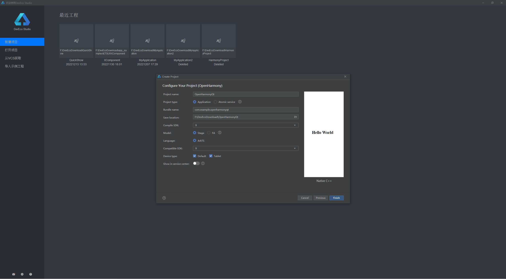
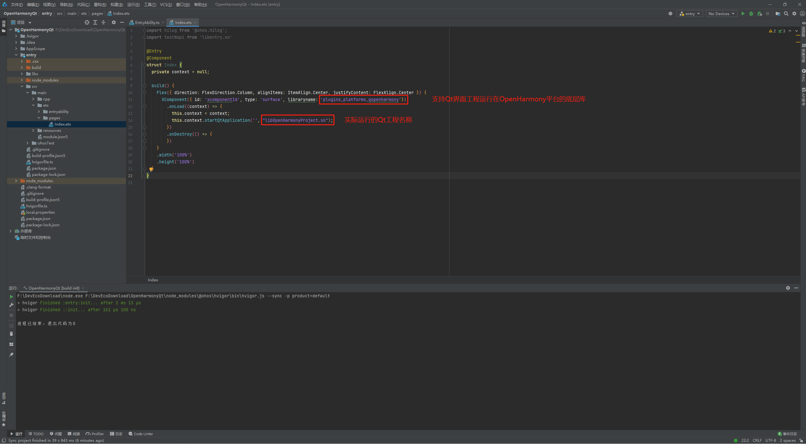
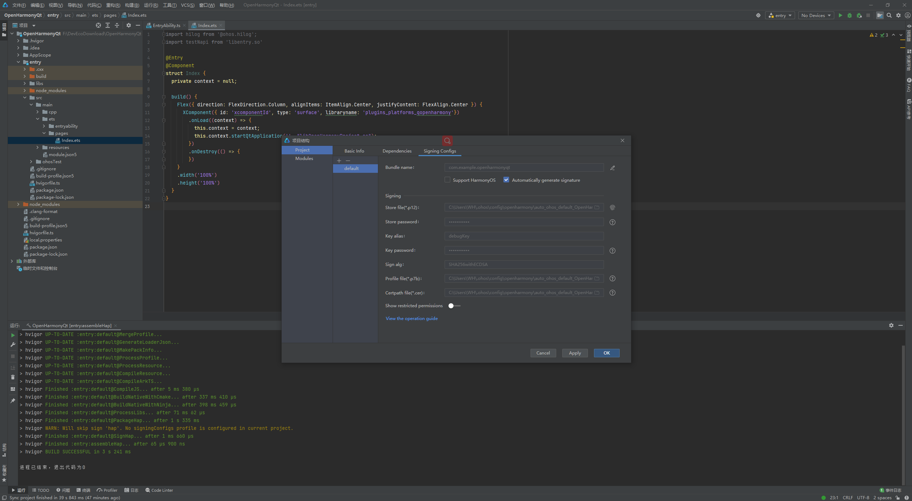
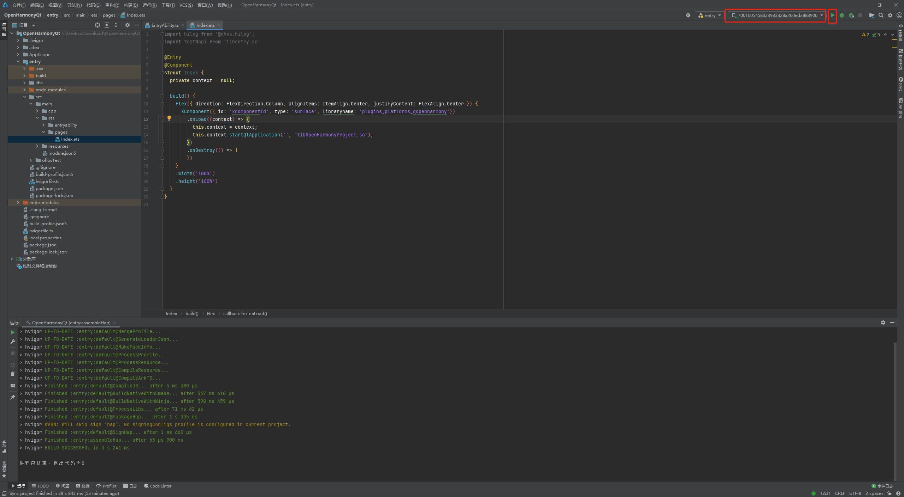
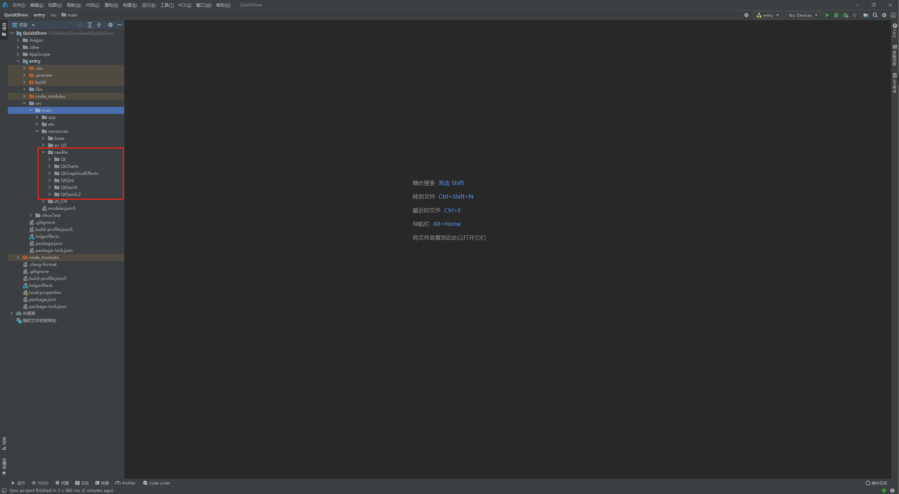

# 文档说明

本文描述了如何运行Qt的Widget示例工程，Qt的所有示例工程都放在SDK中example目录中，如下所示，我们进去widgets目录查看所有widget示例。

# 编译工程

以examples\widgets\widgets\digitalclock为例，使用配置了OpenHarmony构建环境的QtCreator打开该工程然后进行编译，编译构建即可，编译完成后会生成libdigitalclock.so文件。

# 创建ETS工程

下载安装DevEco Studio[^下载]。DevEco Studio 配套支持HarmonyOS 的应用及服务开发，提供了代码智能编辑、低代码开发、双向预览、全新构建工具等功能，持续提升应用及服务开发效率。该工具的使用及配置参考官方文档，本文不做详细介绍。

## 1. 选择工程模板

运行安装的DevEco Studio工具，选择新建项目，在弹出的对话框中选择OpenHarmony下的Native C++项目，然后点击下一步如下图所示。

## 2. 工程信息填写

完成工程模板的选择后，进行必要的工程信息填写，如下图所示，填写工程名称及相关构建版本，然后点击完成生成新的工程项目。

## 3. 使用XComponent集成Qt工程

新建工程完成后内容，如下，修改Index.ets文件中的默认内容，我们使用XComponent组件来完成对Qt工程的集成，使得Qt编译的工程能运行在OPenHarmony系统中，如下图所示。这里`libraryname: 'plugins_platforms_qopenharmony'`为固定值，该库是支持Qt工程和ets工程交互的底层抽象库，该文件存放在QtSDK的plugins\platforms目录中。

## 4. 拷贝依赖项

现在我们将需要集成的Qt工程生成的库文件拷贝及其依赖库拷贝到ets工程中的libs\armeabi-v7a目录中，如果是64位程序则拷贝到相应的v8目录。若在Windows环境下可以使用mingw下的readelf.exe工具查看库的依赖，如下如图所示NEED表示的就是库需要依赖的其他库文件。

我们将非系统下的依赖库拷贝到上述所说目录中，然后构件项目，生成安装包。

## 5. 构建带签名的包

选中上面文件菜单栏中的项目结构，在弹出的窗口中选择Signing Configs然后选择自动生成签名如下图所示，点击OK。现在构件的安装包则为带签名的包。

## 6. 部署到开发板

如果存在实机设备则可以点击导航菜单栏的绿色三角按钮选择部署的设备进行部署运行，如下图所示，程序就会运行在开发板上。

## 7. 添加资源文件

在项目开发中有时会使用到一些资源文件，例如图片资源和音频资源等，在Qt Quick工程中还需要加载QML相关的脚本文件，将需要用到的qml脚本文件等资源文件拷贝到ets工程中的resource目录中，如下图所示。

[^下载]: https://developer.harmonyos.com/cn/develop/deveco-studio
